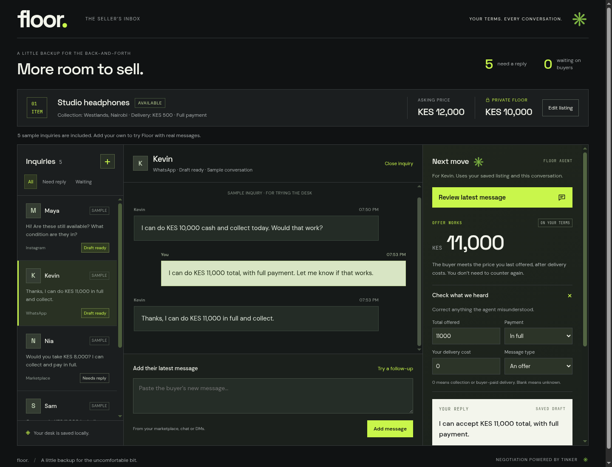

# Floor

**Your terms. Every conversation.**

Floor is a seller inbox agent for the uncomfortable part of selling online: answering questions, weighing offers, and holding a price without losing the conversation.

A listing may attract plenty of messages but few clear offers. “Can you deliver?” changes the amount the seller keeps. “Half now, half next week” is a different deal from full payment. And after several conversations, remembering what you promised each buyer becomes another job.

Floor gives the seller one place to keep those conversations and a second pair of eyes before replying. A model fine-tuned through **Tinker** interprets the buyer's terms; seller tools check the listing, costs, and previous quotes; the seller reviews and sends the reply.



[Watch the 28-second sample inbox walkthrough](https://raw.githubusercontent.com/mutaician/floor/main/docs/demo.mp4).

## What you can do

- Save your listing, asking price, private price floor, condition, collection location, delivery cost, and availability.
- Keep separate buyer conversations, including follow-up messages and replies you have sent.
- Get a recommendation to answer, accept, counter, clarify, or close, with the interpreted offer and payment terms visible.
- Correct misunderstood terms and edit the proposed reply before copying it.
- Record the reply as sent and continue negotiating from your previous quote.
- Return later: listing details, conversations, drafts, and states survive refreshes and server restarts.

The current app supports **one seller and one listing**, in KES or USD. You paste messages from your marketplace or chat and send replies there yourself. “Mark as sent” records that action; it does not send a message to a buyer. The five initial inquiries are labeled, synthetic examples.

## How Tinker fits

This is connected to a saved Tinker sampler checkpoint. The reply workflow does not substitute canned model interpretations.

We fine-tuned **Qwen/Qwen3-8B** with LoRA rank 16 on a mix of existing CraigslistBargains buyer messages and generated negotiation scenarios. The model's job is to extract the offered total, payment type, seller-paid costs, and message intent. Conversation history and saved listing facts provide context at inference time.

The application computes prices from those interpreted terms. An offer meeting the desired net price can be accepted; a lower offer triggers a counter; deposits, installments, and unresolved costs need clarification. Listing tools answer factual questions, and recorded seller quotes prevent needless countering when a buyer agrees to an earlier price. Seller review remains part of every reply.

The selected checkpoint used **three training passes**. On the same 20-case development probe, detailed-prompt baseline decisions with the shared pricing function were correct in **12/20** cases; the selected model reached **19/20**. Exact extraction improved from **5/20 to 15/20**. This small probe was used to choose the checkpoint, so it is not an independent accuracy benchmark. One remaining error confused installments with full payment. See [training notes](docs/training.md) and [data attribution](ATTRIBUTION.md).

## Run locally

Requirements: Python 3.12, [uv](https://docs.astral.sh/uv/), and a Tinker account with access to a compatible saved Qwen3-8B sampler.

```sh
git clone https://github.com/mutaician/floor.git
cd floor
uv sync --locked
cp .env.example .env
```

Set `TINKER_API_KEY` and `TINKER_MODEL_PATH` in `.env`. The checkpoint belongs to your Tinker account; the repository does not include credentials or private checkpoint identifiers. You can train your own checkpoint using the commands below.

```sh
uv run uvicorn app:app --host 127.0.0.1 --port 8000
```

Open **http://localhost:8000**. Edit the listing, select a sample inquiry or add your own, and review the recommendation. Confirm the terms, edit and copy your reply, then mark it as sent after sending it through your chat or marketplace.

On first analysis, Floor downloads the pinned tokenizer files if needed. The 8B model weights remain on Tinker. Without Tinker configuration, you can explore and save the desk, but model analysis will not work.

## Deploy with persistent storage

The included Docker image runs one Uvicorn worker and bakes in the tokenizer. Copy `.env.example` to `.env`, add your Tinker settings, and set **both** `FLOOR_USERNAME` and `FLOOR_PASSWORD` for a hosted seller desk.

```sh
docker compose up --build -d
```

Compose binds to `127.0.0.1:8000` and stores the SQLite database and spending ledger in the `floor-state` volume. Put an HTTPS reverse proxy in front of it when hosting on a server. Keep that volume when rebuilding or restarting; deleting it deletes the saved desk and resets its local spending ledger.

For a container hosting platform, use this repository's `Dockerfile`, configure the environment variables as server secrets, and attach a persistent volume at **`/data`**. The container listens on `PORT` (default `8000`). Use **`/health`** as the health-check path. It reports application availability and whether a model path is configured; it does not make a paid inference call or prove checkpoint access. Run a single replica with the attached volume.

`FLOOR_STATE_DIR` controls the directory for runtime state. `FLOOR_DESK_DB` can override the SQLite file location. The hosted desk is shared by everyone with its credentials; this version does not provide separate user accounts or separate visitor workspaces.

## Data and spending

The API key stays on the server. Buyer messages, bounded conversation history, and listing terms—including the seller's private floor—are sent to Tinker for interpretation. The private floor is omitted from the proposed buyer-facing reply. Conversations and drafts are stored in the desk database. The separate inference cost ledger stores token estimates without buyer text or generated replies.

`FLOOR_BUDGET_USD` defaults to $5 per installation. Floor reserves an estimated charge before dispatch and stops scheduling at 90% of that cap. This guard uses the local ledger and current published token rates; it is not an account-wide billing limit and does not cover checkpoint storage. Keep the ledger on the persistent volume. Changing the environment cap alone does not increase a previously recorded ledger's cap.

Keep the model checkpoint in your Tinker account and verify its retention there before deploying. The selected checkpoint used for this project's development had its scheduled expiry removed; that does not change retention for a different checkpoint you supply.

## Training your own checkpoint

The repository includes the generated Floor scenarios and the preparation/training code. Original human conversations, local inference outputs, trained weights, and seller databases are not bundled. Source details and labeling assumptions are in [ATTRIBUTION.md](ATTRIBUTION.md).

```sh
uv run python scripts/preflight_access.py
uv run python scripts/prepare_existing.py
uv run python floor.py prepare
uv run python floor.py train
```

Preflight checks model access and saves current pricing without generating tokens. Data preparation downloads the existing dataset. Training is a paid Tinker operation and saves its sampler path in `results/checkpoint.json`; put that `sampler_path` into `TINKER_MODEL_PATH`. The default training command runs one pass. For a fresh three-pass run:

```sh
uv run python floor.py train --run three_pass --epochs 3 --from-base
```

That run saves its checkpoints in `results/training_three_pass.json`. Choose the saved sampler path you want to serve. Training artifacts stay local and are ignored by Git. Run these commands with the default state directory, before setting a separate hosted `FLOOR_STATE_DIR`.

## Project map

| Path | Purpose |
| --- | --- |
| `app.py` | Seller inbox API, inference, and listing/conversation tools |
| `static/` | Responsive seller interface and bundled fonts |
| `scripts/desk_store.py` | SQLite persistence and conversation version checks |
| `scripts/budget.py` | Durable inference/training reservations and token cost estimates |
| `scripts/rendering.py` | Shared pinned Qwen tokenizer and renderer |
| `floor.py` | Shared pricing policy, dataset preparation, training, and comparisons |
| `prompts/` | Detailed and compact training/sampling prompts |
| `data/generated/` | Generated scenarios with provenance labels |
| `Dockerfile`, `compose.yaml` | Container build and persistent local/server deployment |
